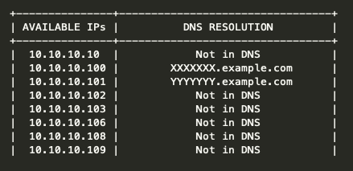

## Subnet Scanner for Unused IPs

## Purpose
Puprpose of this program is to find IPs that can be allocated to a server as static ones.
> This is meant as a way to find which IPs are available to be assigned to a server. Added benefit is that scan reviles IPs that still have a DNS entry while machine they are allocated to does not seem to be available anymore. Can be handy with DNS clean-ups.

## Preparation
python3 is requird to run this program.

Required modules can be found in the requirements.file and installed running below command.
```
pip3 install -r requirements.txt
```
## How it works

Program checks IPs:
  - using ping
  - performing DNS lookup
  - checking if any of the below ports are opened:
      - 22
      - 3389
      - 80
      - 443

## Important
When run on clients (macos) or UNIX as non-root user, pleas execute with **sudo**.

## Output

By default program outputs to stdout in the form of the table. There is option to write optput to file as well.
This creates csv file in location defined in -o/--ouput switch.

Finally -q/--quiet switch supresses stdout and writes to log only.


output will be similar to below.

 
